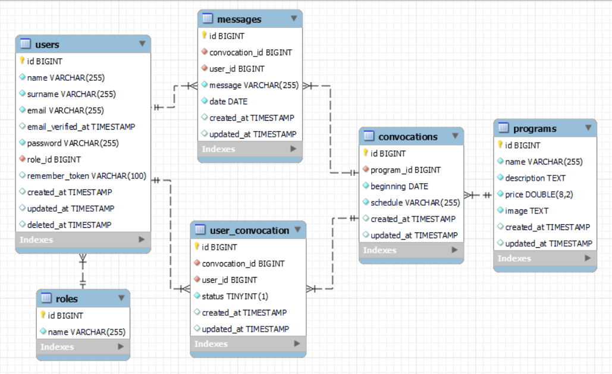

## Backend - AkdemyProject

### Tecnologías utilizadas:

   

### Sobre el proyecto:

El proyecto Akdemy es una aplicación que ofrece diferentes programas y convocatorias a sus usuarios. Los usuarios pueden registrarse en la academia y acceder a una variedad de funcionalidades según su rol. Los administradores tienen privilegios adicionales para gestionar convocatorias y solicitudes de inscripción.

Los usuarios tendrán acceso a su propio perfil, donde podrán visualizar y editar su información personal. Además, podrán explorar todos los programas académicos ofrecidos por la institución, obtener detalles sobre cada uno de ellos y tomar decisiones sobre sus intereses educativos.

Una de las características destacadas para los usuarios es la posibilidad de ver todas las convocatorias vigentes, lo que les permitirá estar al tanto de las oportunidades disponibles para inscribirse en los cursos de su elección. Los usuarios podrán realizar solicitudes de inscripción a las convocatorias deseadas y, una vez enviada la solicitud, se les informará la documentación necesaria para completar el proceso de inscripción. Los usuarios también podrán rastrear el estado de sus solicitudes en su perfil personal dentro de la plataforma brindándoles una comunicación efectiva y transparente durante todo el proceso.

En resumen, Akdemy ofrece a sus usuarios la posibilidad de aprovechar al máximo las oportunidades educativas que la academia proporciona, con un enfoque en la accesibilidad, la transparencia y la facilidad de uso. 

### Instalación en local:

1. Clona el repositorio `$git clone 'url-repository'`
2. Instala las dependencias `composer install`
3. Crea el archivo `.env` y configura la base de datos
4. Ejecuta las migraciones y seeders `php artisan migrate` `php artisan db:seed`
5. Conectamos el servidor`php artisan serve`

### Endpoints:

#### Autenticación

* POST - Registro
* POST - Login

#### Usuarios

* GET - Perfil.
* GET - Ver todos los usuarios (Admin).
* PUT - Editar perfil.
* DELETE - Borrar cuenta.

#### Convocatorias

* GET - Ver todas las convocatorias.
* POST - Crear convocatorias(admin)
* PUT - Modificar convocatorias(admin).

#### Usuario convocatorias

* POST - Crear solicitud inscripción(user).
* GET - Ver solicitudes pendientes(admin).
* POST - Aceptar solicitudes pendientes(admin).
* GET - Ver solicitudes aceptadas(user).

#### Programas

* GET - Ver todos los programas.

### Agradecimientos:

Agradezco a todos mis profesores y compañeros el tiempo dedicado a este proyecto.

### Autor:
Jorge Luis Martin Lorenzo.