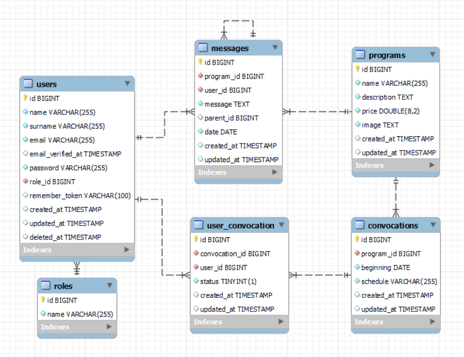

## Backend - AkdemyProject

### Tecnologías utilizadas:

   

### Sobre el proyecto:

Este repositorio contiene el backend de una aplicación diseñada para la visualización de programas, gestión de perfiles de usuario, convocatorias e intercambio de mensajes. Se proporcionan endpoints para realizar dichas operaciones, además de funciones de autenticación.

### Instalación en local:

1. Clona el repositorio `$git clone 'url-repository'`
2. Instala las dependencias `composer install`
3. Crea el archivo `.env` y configura la base de datos
4. Ejecuta las migraciones y seeders `php artisan migrate` `php artisan db:seed`
5. Conectamos el servidor`php artisan serve`

### Endpoints:

#### Autenticación

* POST - Registro
* POST - Login

#### Usuarios

* GET - Perfil.
* GET - Ver todos los usuarios (Admin).
* PUT - Editar perfil.
* DELETE - Borrar cuenta(desactivar).

#### Convocatorias

* GET - Ver todas las convocatorias.
* POST - Crear convocatorias(admin)
* PUT - Modificar convocatorias(admin).

#### Usuario convocatorias (Inscripciónes)

* POST - Crear solicitud inscripción(user).
* GET - Ver solicitudes pendientes(admin).
* POST - Aceptar solicitudes pendientes(admin).
* GET - Ver solicitudes aceptadas(user).

#### Programas

* GET - Ver todos los programas.

#### Mensajería

* POST - Crear mensaje.
* POST - Crear respuesta.
* GET - Ver todos los mensajes.
* DELETE - Borrar mensaje.

### Agradecimientos:

Agradezco a todos mis profesores y compañeros el tiempo dedicado a este proyecto.

### Autor:
Jorge Luis Martin Lorenzo.